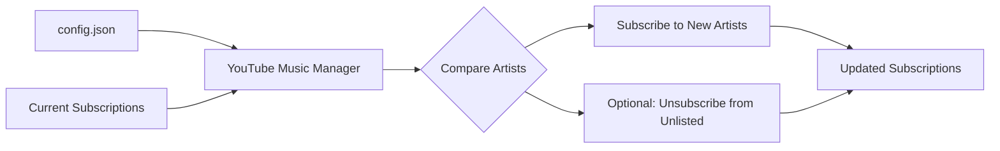
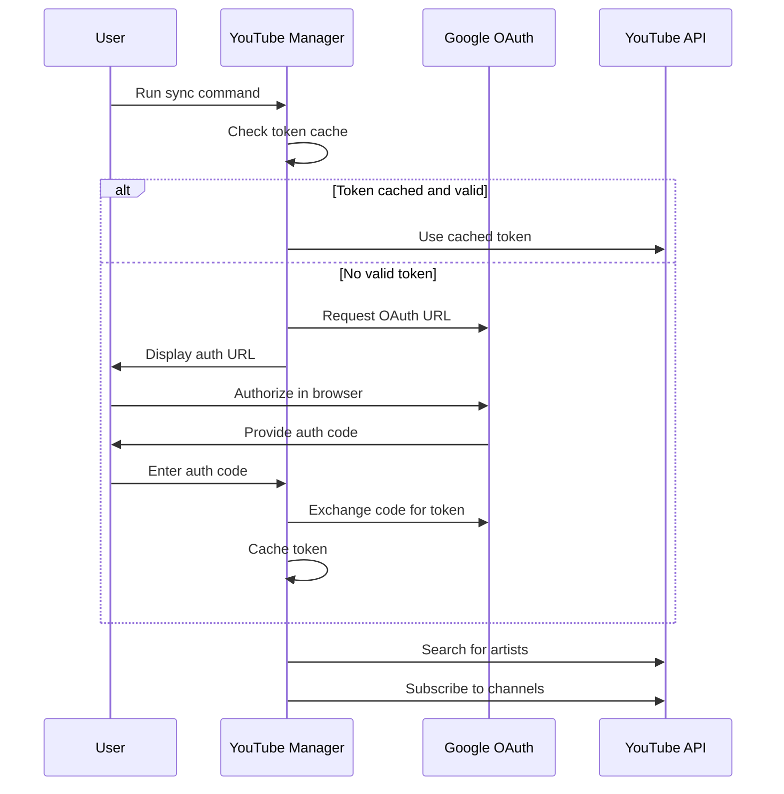

# YouTube Music Manager

A professional CLI tool for managing YouTube Music artist subscriptions using the YouTube Data API v3.

## Demo

[Demo1](resources/demo1.txt)


## Overview

YouTube Music Manager allows you to synchronize your YouTube Music subscriptions with a unified configuration file. It compares your target artist list against your current subscriptions and automatically manages the differences - subscribing to new artists and optionally unsubscribing from those not in your list.



## Key Features

- **Smart Synchronization** - Compare target artists with current subscriptions
- **Unified Configuration** - All settings, credentials, and artists in one config.json file
- **SQLite Caching** - Intelligent caching reduces API costs and improves performance
- **Interactive Pagination** - Browse large artist lists with Y/n prompts
- **Colored Output** - Beautiful terminal interface with intuitive color coding
- **Dry Run Mode** - Preview changes before making them (enabled by default)
- **YouTube Data API Integration** - Direct API access for reliable operations
- **OAuth2 Authentication** - Secure Google account authentication
- **Flexible Format** - Support both config.json and external artist files
- **Professional CLI** - Clean command-line interface with multiple operations
- **Numbered Subscriptions** - Easy-to-reference numbered list display
- **Quick Access** - Open any subscription in YouTube Music with `goto N`
- **Error Handling** - Comprehensive error reporting and recovery
- **Cross-Platform** - Works on Windows, macOS, and Linux

## Installation

### Prerequisites

- Rust (latest stable version)
- Google Cloud Console project with YouTube Data API v3 enabled
- Active YouTube account
- Your favorite artists list!

### Setup Configuration

1. **Create your config file**:
   ```bash
   cp config.example.json config.json
   ```

2. **Create a Google Cloud Console project**:
   - Go to [Google Cloud Console](https://console.cloud.google.com/)
   - Create a new project or select existing one
   - Enable the **YouTube Data API v3**

3. **Create OAuth2 credentials**:
   - Go to **APIs & Services** > **Credentials**
   - Click **Create Credentials** > **OAuth 2.0 Client IDs**
   - Choose **Desktop application**
   - Download the JSON file

4. **Create API Key** (optional but recommended):
   - Go to **APIs & Services** > **Credentials**
   - Click **Create Credentials** > **API Key**
   - Copy the key

5. **Add test users (for development)**:
   - Go to **APIs & Services** > **OAuth consent screen**
   - Scroll to **Test users** section
   - Click **ADD USERS** and add your email address

6. **Configure your config.json**:
   - Open the downloaded OAuth2 credentials file from Google Cloud Console
   - Copy the entire "installed" section into config.json's client_secret field
   - Add your API key
   - Add your artist list
   
   Example:
   ```json
   {
     "google": {
       "client_secret": {
         "installed": {
           "client_id": "your-app-id.apps.googleusercontent.com",
           "project_id": "your-project-name",
           "auth_uri": "https://accounts.google.com/o/oauth2/auth",
           "token_uri": "https://oauth2.googleapis.com/token",
           "auth_provider_x509_cert_url": "https://www.googleapis.com/oauth2/v1/certs",
           "client_secret": "your-oauth-secret",
           "redirect_uris": ["http://localhost"]
         }
       },
       "api_key": "your-youtube-data-api-key-here"
     },
     "database": {
       "cache_db_path": "artist_cache.db",
       "cache_expiry_days": 7
     },
     "artists": [
       "Faith No More",
       "Nine Inch Nails",
       "Radiohead",
       "Tool",
       "Infected Mushroom"
     ],
     "settings": {
       "search_delay_ms": 100,
       "items_per_page": 50,
       "request_timeout_seconds": 30,
       "default_log_level": "warn",
       "token_cache_file": "tokencache.json"
     }
   }
   ```

### Install from Source

```bash
# Clone the repository
git clone git@github.com:cschladetsch/YoutubeMusicSubscriber.git
cd youtube-music-manager

# Build the project
cargo build --release
```

### Verify Installation

```bash
# Test the installation
cargo run -- --help

# List your artists from config.json
cargo run -- list

# Validate a specific artists file (optional)
cargo run -- validate --artists-file artists.txt

# Alternative: Use the convenience script (recommended)
./run --help
./run list
```

## Quick Start

### 1. Configure the Application

Copy the example configuration and edit it with your credentials and artists:

```bash
cp config.example.json config.json
```

Edit `config.json` with your Google credentials and artist list:

```json
{
  "google": {
    "client_secret": { /* Your OAuth2 credentials */ },
    "api_key": "your-api-key"
  },
  "artists": [
    "Faith No More",
    "Nine Inch Nails", 
    "Radiohead",
    "Tool",
    "Infected Mushroom"
  ]
}
```

The configuration file provides:
- **Unified Setup** - All credentials and settings in one place
- **Smart Caching** - Reduces API costs with SQLite database
- **Flexible Artists** - Define your artist list directly in config
- **Customizable Behavior** - Adjust timeouts, pagination, logging levels

**Alternative: Use artists.txt file**
You can still use a separate `artists.txt` file with the `--artists-file` option:

```text
# My favorite artists  
Faith No More
Nine Inch Nails
Radiohead
```

### 2. Test Your Setup

```bash
# List your artists and see cached data (numbered for easy reference)
./run list

# Open any subscription in YouTube Music by number
./run goto 1

# Preview sync changes (safe dry-run mode) 
./run sync

# Get detailed output with caching info
./run --verbose list
./run --verbose sync
```

### 3. Apply Changes

```bash
# Actually make the subscription changes
./run sync --no-dry-run

# Force refresh artist info (bypass cache)
./run list --update-artist-info

# Use external artist file if needed
./run sync --artists-file custom_artists.txt --no-dry-run
```

## Commands

### `sync` - Synchronize Subscriptions

Compares your artist list (from config.json or external file) with current YouTube Music subscriptions using the YouTube Data API.

```bash
./run sync [OPTIONS]
```

**Options:**
- `--artists-file FILE` - Use external artists file (optional, defaults to config.json)
- `--dry-run` - Preview changes without applying them (default behavior)
- `--no-dry-run` - Actually apply the changes
- `--delay SECONDS` - Delay between API requests in seconds (default: 2.0)
- `--interactive` - Ask for confirmation before making changes

**Examples:**
```bash
# Preview sync using config.json artists (safe, default)
./run sync

# Actually apply changes using config.json
./run sync --no-dry-run

# Use external artists file
./run sync --artists-file my_artists.txt --no-dry-run

# Slower pace for rate limiting
./run sync --delay 3
```

### `list` - Show Current Subscriptions

Lists artists from your config with detailed information, using intelligent caching to reduce API costs. Each subscription is numbered for easy reference with the `goto` command.

```bash
./run list [OPTIONS]
```

**Options:**
- `--output FILE` - Save list to a file
- `--artists-file FILE` - Use external artists file (optional, defaults to config.json)
- `--update-artist-info` - Force refresh from API (bypass 7-day cache)

**Features:**
- **Numbered Display** - Each subscription gets a sequential number (1, 2, 3...)
- **Interactive Pagination** - Shows artists in batches with Y/n prompts
- **Smart Caching** - Stores artist data for 7 days to reduce API costs
- **Rich Information** - Shows subscriber counts and descriptions
- **Colored Output** - Beautiful terminal formatting

**Example Output:**
```
1. Faith No More - Topic ( - 7K subs)
2. Nine Inch Nails - Topic ( - 16K subs)
3. Tool (TOOL Official Channel - 2.1M subs)
4. Infected Mushroom - Topic ( - 11K subs)
```

**Examples:**
```bash
# Show artists from config.json (with caching)
./run list

# Force refresh all artist data
./run list --update-artist-info

# Use external file and save results
./run list --artists-file artists.txt --output current_subs.txt
```

### `goto` - Open Subscription in YouTube Music

Opens a specific subscription in YouTube Music using its number from the `list` command.

```bash
./run goto <NUMBER> [OPTIONS]
```

**Arguments:**
- `NUMBER` - Subscription number from the `list` command (starts from 1)

**Options:**
- `--artists-file FILE` - Use external artists file (optional, defaults to config.json)

**Features:**
- **Quick Access** - Jump directly to any subscription by number
- **Browser Integration** - Opens YouTube Music in your default browser
- **Error Handling** - Clear messages for invalid numbers
- **Cross-Platform** - Works on Windows, macOS, and Linux

**Examples:**
```bash
# Open the first subscription in YouTube Music
./run goto 1

# Open subscription #10 using external artists file
./run goto 10 --artists-file artists.txt

# Typical workflow
./run list                    # See numbered subscriptions
./run goto 5                  # Open subscription #5
```

**Example Workflow:**
```bash
$ ./run list
1. Faith No More - Topic ( - 7K subs)
2. Nine Inch Nails - Topic ( - 16K subs)
3. Tool (TOOL Official Channel - 2.1M subs)

$ ./run goto 3
Opening Tool (https://music.youtube.com/channel/UCkgCRdnnqWnUeIH7EIc3dBg)
# Browser opens to Tool's YouTube Music channel
```

### `validate` - Check Artists File

Validates the format of your artists file without making any changes.

```bash
./run validate [OPTIONS]
```

**Options:**
- `--artists-file FILE` - File to validate (default: `artists.txt`)

### Global Options

- `--verbose, -v` - Enable detailed logging output
- `--version` - Show version information
- `--help` - Show help information

## Configuration

### config.json Structure

The `config.json` file contains all application settings:

```json
{
  "google": {
    "client_secret": { /* OAuth2 credentials from Google Cloud */ },
    "api_key": "your-youtube-api-key"
  },
  "database": {
    "cache_db_path": "artist_cache.db",
    "cache_expiry_days": 7
  },
  "artists": [ /* Your artist list */ ],
  "settings": {
    "search_delay_ms": 100,
    "items_per_page": 50,
    "request_timeout_seconds": 30,
    "default_log_level": "warn",
    "token_cache_file": "tokencache.json"
  }
}
```

### Configuration Options

- **google.client_secret** - OAuth2 credentials from Google Cloud Console
- **google.api_key** - YouTube Data API key for public operations
- **database.cache_db_path** - SQLite database location
- **database.cache_expiry_days** - How long to cache artist data
- **artists** - Your artist list (array of strings)
- **settings.search_delay_ms** - Delay between API requests
- **settings.items_per_page** - Pagination size for list command
- **settings.default_log_level** - Logging verbosity (debug/info/warn/error)

### Logging

Logs are written to console with configurable levels:
- **Console**: WARN level and above (DEBUG with `--verbose`)
- **Caching**: All database operations logged
- **API Calls**: Request/response logging with quota tracking

## Important Notes

### Authentication Flow



### Authentication & Setup

- **Unified Config**: All credentials stored in config.json (no separate files needed)
- **OAuth2 Required**: First-time setup requires browser authentication
- **Token Caching**: Authentication tokens cached in configurable location
- **Test Users**: Add your email as test user in Google Cloud Console during development
- **API Permissions**: Requires YouTube Data API v3 enabled in your Google Cloud project

### Performance & Caching

- **Smart Caching**: Artist data cached for 7 days in SQLite database
- **Cost Optimization**: Dramatically reduces API quota usage
- **Cache Control**: Use `--update-artist-info` to force refresh when needed
- **Interactive Experience**: Pagination prevents overwhelming output

### Rate Limiting & Performance

- **Configurable Delays**: Adjustable via config.json (default: 100ms between searches)
- **Intelligent Caching**: 7-day SQLite cache reduces API calls by 90%+
- **Quota Management**: Smart fallbacks when API limits are reached
- **Batch Processing**: Interactive pagination for large artist lists

### Safety Features

- **Dry Run Default**: All sync operations preview changes first
- **Cache-First Approach**: Minimizes expensive API operations
- **Interactive Mode**: Optional confirmation prompts
- **Comprehensive Logging**: All actions and cache operations logged
- **Error Handling**: Graceful handling of failures with detailed error messages

## Troubleshooting

### Common Issues

**"Failed to read config.json"**
```bash
# Copy the example config and edit it
cp config.example.json config.json
# Edit config.json with your Google credentials and artist list
```

**"Failed to parse client_secret from config.json"**
```bash
# Ensure your config.json has the correct OAuth2 format
# Copy the entire "installed" section from Google Cloud Console credentials
```

**"No such file or directory: artists.txt" (when using --artists-file)**
```bash
# Either create the file or use config.json instead
./run list  # Uses config.json artists
./run sync --artists-file /path/to/your/artists.txt  # Uses external file
```

**"Error 403: access_denied" during authentication**
```bash
# Add yourself as a test user in Google Cloud Console
# Go to APIs & Services > OAuth consent screen > Test users
```

**"Failed to search for artist" errors**
```bash
# Ensure YouTube Data API v3 is enabled in Google Cloud Console
# Check API quotas and limits
```

**"API quota exceeded" (403 errors)**
```bash
# Use cached data and wait for quota reset
./run list  # Shows cached artists
# Or request quota increase in Google Cloud Console
```

**"API request timed out"**
```bash
# Complete browser authentication quickly when prompted
# Check your internet connection
./run --verbose sync --delay 5
```

**Cache issues**
```bash
# Force refresh cached data
./run list --update-artist-info
# Or delete cache database
rm artist_cache.db
```

### Debug Mode

For troubleshooting, run with maximum verbosity:

```bash
./run --verbose sync --dry-run --delay 5
```

### Getting Help

1. Check this README and the documentation in `docs/`
2. Validate your artists file: `./run validate --verbose`
3. Try dry-run mode first: `./run --verbose sync`
4. Check the log file: `youtube_music_manager.log`
5. Open an issue with detailed error information

## Development

### Setup Development Environment

```bash
# Clone and setup
git clone <repository-url>
cd youtube-music-manager

# Build the project
cargo build

# Run tests
cargo test
```

### Development Commands

```bash
# Build debug version
cargo build

# Build release version
cargo build --release

# Run tests
cargo test

# Run with logging
RUST_LOG=debug cargo run -- --verbose sync --dry-run

# Check code
cargo clippy
```

### Project Structure

```
youtube-music-manager/
├── src/                     # Rust source code
│   ├── main.rs             # Command-line interface and main logic
│   └── youtube.rs          # YouTube API client and authentication
├── docs/                   # Documentation
│   ├── ARCHITECTURE.md     # Technical architecture
│   └── DEVELOPMENT.md      # Development guide
├── artists.txt             # Example artists file
├── Cargo.toml             # Rust project configuration
├── README.md              # This file
└── CHANGELOG.md           # Version history
```

## Version History

### v0.1.0 (Current)
- Complete rewrite in Rust with professional CLI architecture
- YouTube Data API v3 integration for reliable operations
- OAuth2 authentication with token caching
- Direct API access replacing browser automation
- Comprehensive error handling and logging
- Dry-run mode for safety
- Flexible artist file format with tags
- Cross-platform support

See [CHANGELOG.md](CHANGELOG.md) for detailed version history.

See [docs/DEVELOPMENT.md](docs/DEVELOPMENT.md) for detailed development guidelines.

## License

This project is licensed under the MIT License - see the [LICENSE](LICENSE) file for details.

## Acknowledgments

- [Google YouTube Data API v3](https://developers.google.com/youtube/v3) for reliable YouTube integration
- [Rust](https://www.rust-lang.org/) for high-performance system programming
- [Clap](https://clap.rs/) for command-line interface
- [Tokio](https://tokio.rs/) for async runtime

---

**Disclaimer:** This tool is for educational and personal use only. Use responsibly and respect YouTube's Terms of Service. The authors are not responsible for any account restrictions that may result from automated activity.
