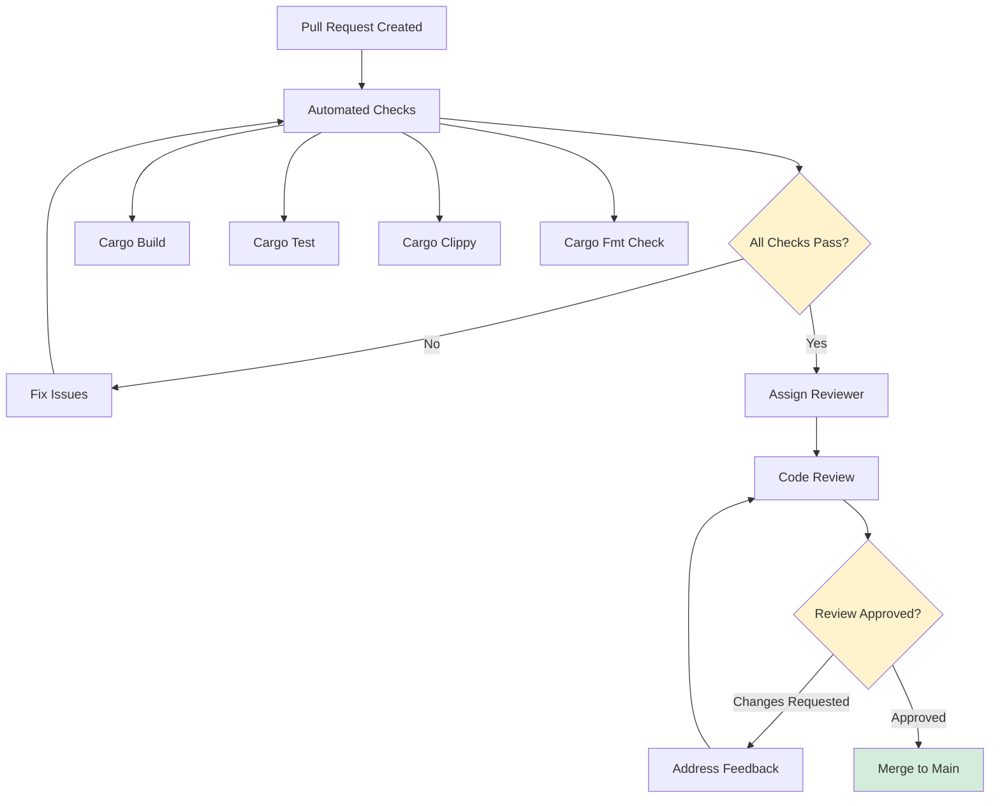
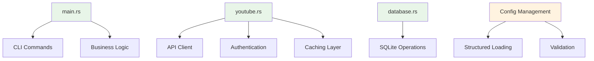
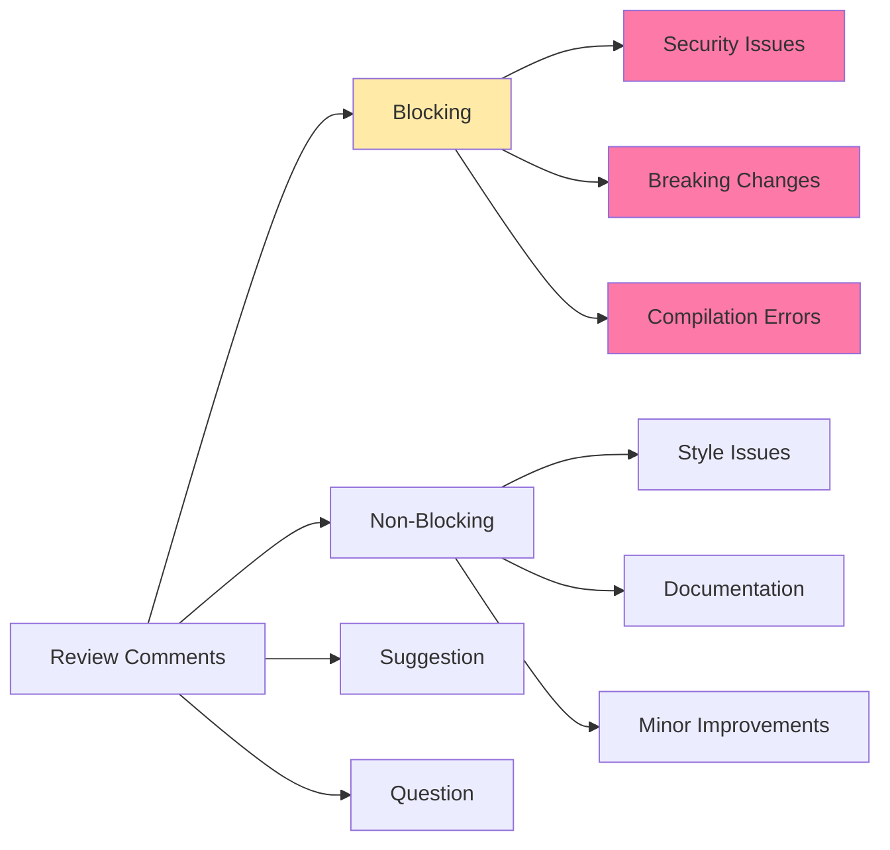

# Code Review Guidelines

This document outlines the code review standards, processes, and quality criteria for YouTube Music Manager. All contributions must adhere to these guidelines to ensure code quality, security, and maintainability.

## Review Process Overview



## Review Checklist

### 🔧 Technical Standards

#### Rust Code Quality
- [ ] **Compilation**: Code compiles without errors or warnings
- [ ] **Clippy**: All `cargo clippy` suggestions addressed (zero warnings policy)
- [ ] **Formatting**: Code formatted with `cargo fmt` (consistent style)
- [ ] **Error Handling**: Proper use of `Result<T, E>` and `anyhow` for error context
- [ ] **Memory Safety**: No unsafe code without explicit justification
- [ ] **Performance**: Async/await used appropriately, no blocking in async contexts

#### Architecture Compliance
- [ ] **Separation of Concerns**: Changes respect module boundaries
- [ ] **Dependency Direction**: No circular dependencies or architectural violations
- [ ] **Configuration**: Settings properly externalized to config.json
- [ ] **Caching**: Database operations use established caching patterns
- [ ] **API Integration**: YouTube API calls follow established patterns

### 🔒 Security Review

#### Authentication & Credentials
- [ ] **No Hardcoded Secrets**: Credentials loaded from config.json only
- [ ] **OAuth2 Security**: Token handling follows security best practices
- [ ] **Input Validation**: All user inputs validated and sanitized
- [ ] **Error Information**: No sensitive data leaked in error messages
- [ ] **File Permissions**: Proper handling of credential files

#### API Security
- [ ] **Rate Limiting**: API calls respect YouTube quota limits
- [ ] **Timeout Handling**: All network operations have reasonable timeouts
- [ ] **HTTPS Only**: All external communications use HTTPS
- [ ] **Scope Minimization**: OAuth2 requests minimum required permissions

### 📊 Data & Database

#### SQLite Operations
- [ ] **Schema Compliance**: Database operations match established schema
- [ ] **Transaction Safety**: Proper transaction handling for data consistency
- [ ] **Cache Strategy**: Follows 7-day expiry and cache-first patterns
- [ ] **Error Recovery**: Database errors handled gracefully
- [ ] **Migration Safety**: Schema changes include migration path

#### Data Validation
- [ ] **Artist Data**: Artist information properly validated before storage
- [ ] **Configuration**: Config.json structure validated on load
- [ ] **File Format**: External files (artists.txt) parsed safely

### 🧪 Testing & Quality

#### Test Coverage
- [ ] **Unit Tests**: New functionality includes appropriate unit tests
- [ ] **Integration Tests**: API integration tested with dry-run mode
- [ ] **Error Path Testing**: Error conditions tested and handled
- [ ] **Manual Testing**: Interactive features tested manually

#### Code Quality
- [ ] **Readability**: Code is self-documenting with clear variable names
- [ ] **Complexity**: Functions are focused and not overly complex
- [ ] **Documentation**: Public APIs documented with doc comments
- [ ] **Version Compatibility**: Changes maintain backward compatibility

## Architectural Review Criteria

### 🏗️ System Design

#### Module Structure


#### Design Pattern Compliance
- [ ] **Command Pattern**: CLI commands properly separated
- [ ] **Factory Pattern**: Client construction follows established pattern
- [ ] **Repository Pattern**: Database access through repository layer
- [ ] **Strategy Pattern**: Multiple auth strategies properly implemented
- [ ] **Builder Pattern**: Configuration building uses derive macros

### 🔄 Data Flow Validation

#### Sync Operation Flow
- [ ] **Config Loading**: Proper configuration validation and loading
- [ ] **Cache Check**: SQLite cache checked before API calls
- [ ] **API Operations**: YouTube API called with proper error handling
- [ ] **Data Updates**: Cache updated with fresh data
- [ ] **User Feedback**: Clear output with colored formatting

#### Authentication Flow
- [ ] **Token Cache**: Existing tokens validated before use
- [ ] **OAuth2 Flow**: Interactive authentication properly handled
- [ ] **Error Recovery**: Auth failures handled gracefully
- [ ] **Token Storage**: Secure token caching implementation

## Code Style Guidelines

### 🎨 Rust Conventions

#### Naming Standards
```rust
// ✅ Good: Clear, descriptive names
async fn get_cached_artist(&self, search_name: &str) -> Result<Option<Artist>>
pub struct YouTubeClient { ... }
const DEFAULT_CACHE_EXPIRY_DAYS: u32 = 7;

// ❌ Bad: Unclear or non-standard names  
async fn get_art(&self, name: &str) -> Result<Option<Artist>>
pub struct YTClient { ... }
const DAYS: u32 = 7;
```

#### Error Handling Patterns
```rust
// ✅ Good: Contextual error handling
pub async fn search_artist(&self, artist_name: &str) -> Result<Option<Artist>> {
    let response = self.client.search()
        .execute()
        .await
        .context(format!("Failed to search for artist '{}'", artist_name))?;
    
    // Process response...
}

// ❌ Bad: Generic error propagation
pub async fn search_artist(&self, artist_name: &str) -> Result<Option<Artist>> {
    let response = self.client.search().execute().await?;
    // No context about what failed
}
```

#### Async/Await Best Practices
```rust
// ✅ Good: Proper async structure
#[tokio::main]
async fn main() -> Result<()> {
    let client = YouTubeClient::new().await?;
    let artists = client.get_artists().await?;
    Ok(())
}

// ❌ Bad: Mixing sync/async incorrectly
fn main() -> Result<()> {
    tokio::runtime::Runtime::new()?.block_on(async {
        // Should use #[tokio::main] instead
    })
}
```

### 📝 Documentation Standards

#### Public API Documentation
```rust
/// Searches for a YouTube channel by artist name using the YouTube Data API.
///
/// This function first checks the SQLite cache for existing artist data. If found
/// and not expired, returns cached data. Otherwise, performs a fresh API search.
///
/// # Arguments
/// * `artist_name` - The name of the artist to search for
///
/// # Returns
/// * `Ok(Some(Artist))` - Artist found and data retrieved
/// * `Ok(None)` - Artist not found in search results  
/// * `Err(...)` - API error or network failure
///
/// # Examples
/// ```no_run
/// let client = YouTubeClient::new().await?;
/// let artist = client.search_artist("Radiohead").await?;
/// ```
pub async fn search_artist(&self, artist_name: &str) -> Result<Option<Artist>> {
    // Implementation...
}
```

#### Configuration Documentation
```rust
#[derive(Debug, Clone, Serialize, Deserialize)]
pub struct SettingsConfig {
    /// Delay between API search requests in milliseconds (default: 100)
    pub search_delay_ms: u64,
    
    /// Number of items to display per page in list mode (default: 50)  
    pub items_per_page: usize,
    
    /// Request timeout for API calls in seconds (default: 30)
    pub request_timeout_seconds: u64,
}
```

## Performance Review

### ⚡ Performance Standards

#### Caching Efficiency
- [ ] **Cache Hit Ratio**: Aim for >90% cache hit ratio in normal usage
- [ ] **Cache Expiry**: 7-day default expiry balances freshness vs cost
- [ ] **Cache Size**: Reasonable limits on cache database growth
- [ ] **Query Performance**: Database queries optimized with proper indices

#### API Efficiency  
- [ ] **Rate Limiting**: Configurable delays prevent quota exhaustion
- [ ] **Batch Operations**: Multiple operations grouped where possible
- [ ] **Connection Reuse**: HTTP client properly reuses connections
- [ ] **Timeout Configuration**: Reasonable timeouts prevent hanging

#### Memory Management
- [ ] **Resource Cleanup**: Proper resource disposal (RAII patterns)
- [ ] **Memory Usage**: No obvious memory leaks or excessive allocations
- [ ] **Streaming**: Large datasets processed in streams when appropriate

### 📈 Performance Metrics

#### Acceptable Performance Targets
```rust
// Example performance expectations
const MAX_SEARCH_TIME_MS: u64 = 5000;        // 5 seconds max per search
const MAX_CACHE_LOOKUP_MS: u64 = 100;        // 100ms max cache lookup
const MAX_CONFIG_LOAD_MS: u64 = 500;         // 500ms max config loading
const MAX_MEMORY_USAGE_MB: u64 = 50;         // 50MB max memory footprint
```

## Security Review Checklist

### 🛡️ Security Standards

#### Credential Management
- [ ] **No Plaintext Storage**: Credentials never stored in plaintext logs
- [ ] **Config File Security**: config.json properly excluded from git
- [ ] **Token Rotation**: OAuth2 tokens properly refreshed
- [ ] **Secure Defaults**: Dry-run mode enabled by default for safety

#### Input Validation
```rust
// ✅ Good: Proper input validation
pub fn validate_artist_name(name: &str) -> Result<()> {
    if name.trim().is_empty() {
        return Err(anyhow!("Artist name cannot be empty"));
    }
    if name.len() > MAX_ARTIST_NAME_LENGTH {
        return Err(anyhow!("Artist name too long"));
    }
    // Additional validation...
    Ok(())
}

// ❌ Bad: No input validation
pub fn search_artist(name: &str) -> Result<Artist> {
    // Directly using unvalidated input
    api_call(name)
}
```

#### API Security
- [ ] **HTTPS Enforcement**: All external requests use HTTPS
- [ ] **Certificate Validation**: Proper TLS certificate verification
- [ ] **Request Signing**: OAuth2 requests properly signed
- [ ] **Error Handling**: No sensitive data in error messages

## Dependency Review

### 📦 Dependency Management

#### Acceptable Dependencies
Current approved dependencies from Cargo.toml:

```toml
[dependencies]
# Core functionality
clap = "4.4"              # CLI framework
serde = "1.0"             # Serialization
tokio = "1.0"             # Async runtime
anyhow = "1.0"            # Error handling

# YouTube API
google-youtube3 = "6.0"   # Official Google API client
yup-oauth2 = "12.0"       # OAuth2 implementation

# Database
rusqlite = "0.32"         # SQLite integration

# Utilities
colored = "2.1"           # Terminal colors
chrono = "0.4"            # Date/time handling
```

#### New Dependency Criteria
- [ ] **Necessity**: Dependency provides significant value
- [ ] **Maintenance**: Active maintenance and security updates
- [ ] **License**: Compatible with MIT license
- [ ] **Security**: No known security vulnerabilities
- [ ] **Size**: Reasonable impact on binary size
- [ ] **Alternatives**: Evaluated against existing solutions

### 🔍 Version Management
- [ ] **Pinned Versions**: Dependencies pinned to specific versions
- [ ] **Security Updates**: Regular dependency updates for security
- [ ] **Breaking Changes**: Careful evaluation of major version updates
- [ ] **Minimal Versions**: Use minimal feature sets to reduce bloat

## Review Workflow

### 👥 Reviewer Assignment

#### Primary Reviewers
1. **Architecture Review**: Senior developer familiar with system design
2. **Security Review**: Security-focused reviewer for sensitive changes  
3. **Performance Review**: Developer experienced with Rust performance
4. **Domain Review**: Reviewer familiar with YouTube API integration

#### Review Timeline
- **Small Changes** (< 50 lines): 1-2 business days
- **Medium Changes** (50-200 lines): 2-3 business days  
- **Large Changes** (> 200 lines): 3-5 business days
- **Critical Security**: Same-day review required

### 📝 Review Comments

#### Comment Categories


#### Comment Template
```markdown
**Category**: [Blocking|Non-Blocking|Suggestion|Question]
**File**: src/youtube.rs:123
**Issue**: Brief description of the issue

**Details**: Detailed explanation of the problem and why it matters

**Suggestion**: Specific recommendation for improvement

**Example**: 
```rust
// Instead of:
let result = api_call().await?;

// Consider:
let result = api_call().await
    .context("Failed to call YouTube API")?;
```

**Priority**: [High|Medium|Low]
```

## Quality Gates

### 🚪 Merge Requirements

#### Automated Checks (Required)
- [ ] ✅ `cargo build` - Clean compilation
- [ ] ✅ `cargo test` - All tests passing
- [ ] ✅ `cargo clippy` - Zero warnings
- [ ] ✅ `cargo fmt --check` - Proper formatting
- [ ] ✅ Security scan - No new vulnerabilities

#### Manual Review (Required)
- [ ] ✅ Code review approval from designated reviewer
- [ ] ✅ Architecture review for structural changes
- [ ] ✅ Security review for sensitive changes
- [ ] ✅ Documentation updated for new features

#### Integration Testing
- [ ] ✅ Dry-run mode testing
- [ ] ✅ OAuth2 flow testing
- [ ] ✅ Cache functionality testing
- [ ] ✅ Error handling validation

### 🎯 Quality Metrics

#### Code Quality Targets
```rust
// Quality thresholds
const MAX_FUNCTION_LENGTH: usize = 50;        // Lines per function
const MAX_FILE_LENGTH: usize = 500;           // Lines per file  
const MAX_CYCLOMATIC_COMPLEXITY: u32 = 10;   // Complexity per function
const MIN_TEST_COVERAGE: f32 = 80.0;          // Percentage coverage
```

#### Performance Thresholds
- **Build Time**: < 30 seconds for clean build
- **Binary Size**: < 10MB for release binary
- **Memory Usage**: < 50MB during normal operation
- **Startup Time**: < 2 seconds for CLI startup

## Documentation Review

### 📚 Documentation Standards

#### Required Documentation
- [ ] **API Documentation**: All public functions documented
- [ ] **Configuration**: All config options explained
- [ ] **Architecture**: Major changes documented in ARCHITECTURE.md
- [ ] **Examples**: Usage examples for new features
- [ ] **Migration**: Breaking changes include migration guide

#### Documentation Quality
- [ ] **Accuracy**: Documentation matches implementation
- [ ] **Completeness**: All parameters and return values documented
- [ ] **Examples**: Working code examples provided
- [ ] **Clarity**: Clear, concise explanations
- [ ] **Maintenance**: Documentation updated with code changes

### 📖 Review Documentation Changes

#### Mermaid Diagrams
- [ ] **Syntax**: Valid Mermaid syntax that renders correctly
- [ ] **Relevance**: Diagrams accurately represent the system
- [ ] **Consistency**: Visual style consistent across diagrams
- [ ] **Maintenance**: Diagrams updated with architectural changes

## Conclusion

This review process ensures high-quality, secure, and maintainable code for YouTube Music Manager. All contributors should familiarize themselves with these guidelines and reviewers should reference this document during the review process.

For questions about the review process, please refer to the [DEVELOPMENT.md](docs/DEVELOPMENT.md) guide or open an issue for clarification.

---

**Last Updated**: 2025-01-06  
**Version**: 1.0  
**Maintainer**: Project Team