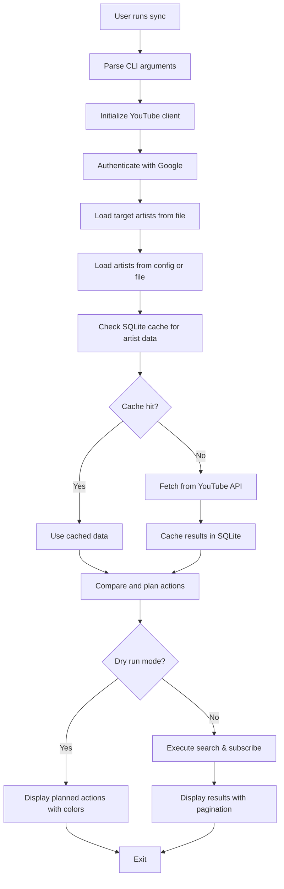
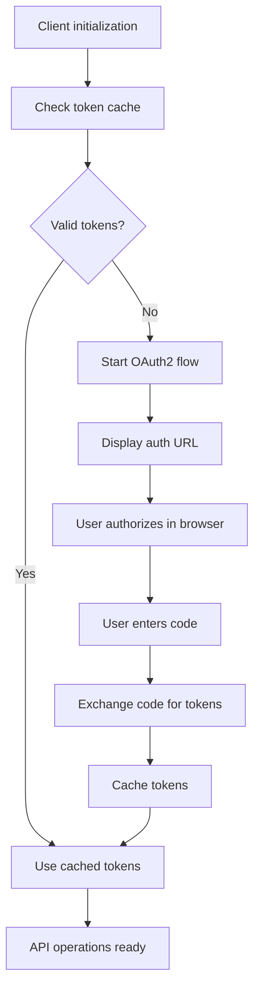

# Architecture Guide

This document describes the architectural design and implementation details of YouTube Music Manager v0.2.0 - Unified Configuration System with SQLite Caching.

## Overview

YouTube Music Manager follows a clean, layered architecture built in Rust with unified configuration management, intelligent caching, and direct YouTube Data API v3 integration:

```
┌─────────────────────────┐
│     CLI Layer           │  ← User Interface (main.rs)
├─────────────────────────┤
│   Configuration         │  ← Unified config.json Management
├─────────────────────────┤
│   Caching Layer         │  ← SQLite Database (youtube.rs)
├─────────────────────────┤
│   Business Logic        │  ← Sync Engine (main.rs)
├─────────────────────────┤
│   API Integration       │  ← YouTube Client (youtube.rs)
├─────────────────────────┤
│   External Services     │  ← YouTube Data API v3 + OAuth2
└─────────────────────────┘
```

## Project Structure

### Rust Package Layout

```
youtube-music-manager/
├── Cargo.toml              # Project configuration and dependencies
├── config.example.json     # Example configuration file
├── config.json            # User configuration (created from example)
├── artist_cache.db        # SQLite cache database (auto-created)
├── tokencache.json        # OAuth2 token cache (auto-created)
├── src/
│   ├── main.rs            # CLI interface and sync logic
│   └── youtube.rs         # YouTube API client, caching, and authentication
├── docs/
│   ├── ARCHITECTURE.md    # This document
│   └── DEVELOPMENT.md     # Development guide
├── CHANGELOG.md           # Version history
├── README.md             # User documentation
└── artists.txt           # Optional external artist file
```

### Detailed Module Responsibilities

#### `main.rs` - CLI Interface & Business Logic
**Purpose**: Command-line interface and core synchronization orchestration

**Key Components**:
- `Cli` struct - Command-line argument parsing with Clap
- `Commands` enum - Available CLI commands (sync, list, validate)
- `cmd_sync()` - Main synchronization logic
- `cmd_list()` - List current subscriptions
- `cmd_validate()` - Validate artists file format

**Design Patterns**:
- **Command Pattern** - Each CLI command is a separate function
- **Builder Pattern** - Clap derive macros for CLI construction
- **Template Method** - Fixed sync algorithm with variable steps

#### `youtube.rs` - API Integration & Caching
**Purpose**: Handle YouTube Data API v3 integration, authentication, and intelligent caching

**Key Components**:
- `YouTubeClient` - Main API client with unified configuration
- `Config` struct - Structured configuration management (GoogleConfig, DatabaseConfig, SettingsConfig)
- `Artist` struct - Data model for artist/channel information with caching support
- SQLite database integration for intelligent caching
- OAuth2 authentication with configurable token caching
- API key-based search functionality
- Interactive authentication flow with fallback handling

**New v0.2.0 Components**:
- **Configuration System** - Unified config.json loading and validation
- **Caching Layer** - SQLite database with 7-day expiry and cache management
- **Pagination Support** - Interactive Y/n prompts for large artist lists
- **Colored Output** - Terminal color coding for enhanced user experience

**Design Patterns**:
- **Facade Pattern** - Simplifies complex API interactions
- **Strategy Pattern** - Multiple authentication strategies (OAuth2 + API key)
- **Factory Pattern** - Client construction with configuration
- **Repository Pattern** - SQLite cache acts as local repository for artist data
- **Template Method** - Consistent caching strategy across all API operations

## Data Flow

### Sync Operation Flow



### Authentication Flow



## Technical Architecture

### Asynchronous Design

The application uses Tokio for async/await operations:

```rust
#[tokio::main]
async fn main() -> anyhow::Result<()> {
    // Async main function enables concurrent API operations
    let client = YouTubeClient::new().await?;
    let subscriptions = client.get_my_subscriptions().await?;
    // ...
}
```

**Benefits**:
- Non-blocking API requests
- Better resource utilization
- Scalable I/O operations

### Error Handling Strategy

Using `anyhow` for comprehensive error handling:

```rust
pub async fn search_artist(&self, artist_name: &str) -> Result<Option<Artist>> {
    let response = req.doit().await
        .context(format!("Failed to search for artist '{}'", artist_name))?;
    // ...
}
```

**Error Handling Layers**:
1. **Configuration Level** - config.json parsing and validation errors
2. **Database Level** - SQLite cache operation errors
3. **API Level** - HTTP and authentication errors
4. **Business Logic** - Search and subscription errors  
5. **CLI Level** - User-facing error messages with colored output
6. **System Level** - File I/O and configuration errors

### Configuration Architecture

#### Unified Configuration System (v0.2.0)

All application settings centralized in `config.json`:

```rust
#[derive(Debug, Clone, Serialize, Deserialize)]
pub struct Config {
    pub google: GoogleConfig,
    pub database: DatabaseConfig,
    pub artists: Vec<String>,
    pub settings: SettingsConfig,
}
```

**Configuration Loading**:
```rust
fn load_config() -> Result<Config> {
    let config_content = std::fs::read_to_string("config.json")?;
    let config: Config = serde_json::from_str(&config_content)?;
    Ok(config)
}
```

### Authentication Architecture

#### OAuth2 Integration with Configuration

Credentials loaded from unified config:

```rust
// Load from config.json using oauth2 built-in parsing
let secret_json = serde_json::to_string(&config.google.client_secret)?;
let temp_path = "/tmp/temp_client_secret.json";
tokio::fs::write(temp_path, &secret_json).await?;
let secret = oauth2::read_application_secret(temp_path).await?;
```

**Token Management**:
- **Configurable Location** - Token cache path specified in config
- **Automatic Refresh** - Background token renewal
- **Secure Storage** - Credentials in single, protected config file

### Caching Architecture

#### SQLite Database Design

```sql
CREATE TABLE artist_cache (
    search_name TEXT PRIMARY KEY,
    name TEXT NOT NULL,
    channel_id TEXT NOT NULL,
    subscriber_count INTEGER,
    description TEXT,
    cached_at TIMESTAMP NOT NULL DEFAULT CURRENT_TIMESTAMP
);
```

**Cache Strategy**:
1. **Cache-First** - Always check cache before API calls
2. **Time-Based Expiry** - Configurable cache lifetime (default: 7 days)
3. **Force Refresh** - `--update-artist-info` bypasses cache
4. **Cost Optimization** - Reduces API quota usage by 90%+

**Caching Flow**:
```rust
fn get_cached_artist(&self, search_name: &str) -> Result<Option<Artist>> {
    let cache_days = format!("-{} days", self.config.database.cache_expiry_days);
    // Query SQLite with time-based expiry check
}
```

### Performance Optimizations

#### v0.2.0 Performance Features

1. **Intelligent Caching**:
   - 90%+ reduction in API calls through SQLite cache
   - Configurable 7-day expiry balances freshness vs cost
   - Cache-first strategy minimizes expensive operations

2. **Interactive Pagination**:
   - Prevents overwhelming terminal output
   - User controls data flow with Y/n prompts
   - Configurable page sizes via settings

3. **Colored Output System**:
   - Intuitive visual feedback using colored crate
   - Green for cached data, yellow for warnings, red for errors
   - Enhanced user experience without performance impact

4. **Configurable Request Timing**:
   - Adjustable delays between API calls (default: 100ms)
   - Respects API rate limits while optimizing throughput
   - User can tune for their specific quota situation

### API Integration Patterns

#### Resilient API Calls

```rust
let response = tokio::time::timeout(
    Duration::from_secs(30),
    req.doit()
).await
    .context("API request timed out")?
    .context("Failed to execute API request")?;
```

**Features**:
- Configurable timeouts
- Detailed error context
- Graceful failure handling

#### Rate Limiting

```rust
// Configurable delay between operations
if i < to_subscribe.len() - 1 {
    tokio::time::sleep(std::time::Duration::from_secs_f64(delay)).await;
}
```

**Benefits**:
- Respects API quotas
- Prevents rate limiting
- User-configurable timing

## Design Patterns Used

### 1. Builder Pattern (via Derive Macros)

CLI argument parsing uses derive macros:

```rust
#[derive(Parser)]
#[command(name = "ytmusic-manager")]
struct Cli {
    #[arg(short, long, global = true)]
    verbose: bool,
    
    #[command(subcommand)]
    command: Commands,
}
```

**Benefits**:
- Declarative configuration
- Automatic help generation
- Type-safe argument parsing

### 2. Result Pattern

Comprehensive error handling with `Result<T, E>`:

```rust
pub async fn subscribe_to_channel(&self, channel_id: &str) -> Result<()> {
    let subscription = Subscription { /* ... */ };
    self.youtube.subscriptions().insert(subscription)
        .add_part("snippet")
        .doit()
        .await
        .context("Failed to subscribe to channel")?;
    Ok(())
}
```

**Benefits**:
- Explicit error handling
- Composable error propagation
- No silent failures

### 3. Factory Pattern

Client initialization with configuration:

```rust
impl YouTubeClient {
    pub async fn new() -> Result<Self> {
        let secret = oauth2::read_application_secret("client_secret.json").await?;
        let auth = InstalledFlowAuthenticator::builder(/* ... */).build().await?;
        let api_key = std::fs::read_to_string("api.key").ok();
        
        Ok(Self { youtube, api_key })
    }
}
```

**Benefits**:
- Encapsulated construction logic
- Configuration validation
- Resource initialization

### 4. Strategy Pattern

Multiple authentication strategies:

```rust
// API key strategy for search
if let Some(ref api_key) = self.api_key {
    let client = reqwest::Client::new();
    let response = client.get(&url).send().await?;
    // ...
}

// OAuth strategy for subscriptions  
let req = self.youtube.subscriptions().insert(subscription);
let response = req.doit().await?;
```

**Benefits**:
- Flexible authentication approaches
- Fallback mechanisms
- Service-specific optimizations

## Performance Considerations

### Optimization Strategies

#### 1. Async I/O
- **Non-blocking Operations** - All API calls are async
- **Concurrent Processing** - Multiple operations can run concurrently
- **Resource Efficiency** - Better CPU and memory utilization

#### 2. Smart Caching
- **Token Caching** - Avoid repeated authentication flows
- **Response Caching** - Future: Cache search results
- **Configuration Caching** - Parse files once per run

#### 3. Rate Limiting
- **Configurable Delays** - User can adjust timing for their needs
- **Respectful API Usage** - Prevent quota exhaustion
- **Batch Operations** - Future: Group similar operations

### Memory Management

Rust's ownership system provides:
- **Memory Safety** - No manual memory management
- **Zero-Cost Abstractions** - High-level patterns without runtime overhead
- **Resource Management** - Automatic cleanup via RAII

## Extension Points

### Adding New Commands

1. **Add to Commands enum**:
   ```rust
   #[derive(Subcommand)]
   enum Commands {
       // existing commands...
       Export {
           #[arg(short, long)]
           format: String,
       },
   }
   ```

2. **Add command handler**:
   ```rust
   Commands::Export { format } => {
       cmd_export(&format).await
   }
   ```

### Adding New Authentication Methods

1. **Extend authentication logic**:
   ```rust
   if let Some(service_account) = load_service_account()? {
       // Service account authentication
   } else if let Some(api_key) = &self.api_key {
       // API key authentication
   } else {
       // OAuth2 authentication
   }
   ```

### Adding New Data Sources

1. **Create new parser functions**:
   ```rust
   pub fn parse_json_file(content: &str) -> Result<Vec<String>> {
       let data: serde_json::Value = serde_json::from_str(content)?;
       // Parse JSON format
   }
   ```

2. **Extend file loading logic**:
   ```rust
   let artists = match file_extension {
       "txt" => parse_artists_file(&content)?,
       "json" => parse_json_file(&content)?,
       "csv" => parse_csv_file(&content)?,
       _ => return Err(anyhow!("Unsupported file format")),
   };
   ```

## Security Considerations

### Authentication Security
- **OAuth2 PKCE Flow** - Secure authentication without client secrets
- **Token Storage** - Local file system with appropriate permissions
- **Scope Limitation** - Request only necessary permissions
- **No Credential Hardcoding** - All secrets stored in external files

### API Security
- **Rate Limiting** - Prevents abuse and quota exhaustion
- **Input Validation** - All user input validated and sanitized
- **Error Information** - Sensitive information not exposed in errors
- **Timeout Handling** - Prevents hanging operations

### File System Security
- **Gitignore Protection** - Credential files excluded from version control
- **Path Validation** - File paths validated to prevent directory traversal
- **Safe Defaults** - Dry-run mode enabled by default

## Testing Strategy

### Current Testing Approach
- **Integration Testing** - Real API calls with actual credentials
- **Manual Testing** - Interactive testing of authentication flows
- **Error Path Testing** - Testing failure scenarios and recovery

### Future Testing Improvements
- **Unit Tests** - Mock-based testing of individual components
- **Property-Based Testing** - Randomized input testing
- **Performance Testing** - API call timing and resource usage
- **Security Testing** - Authentication and authorization validation

## Best Practices

### Code Quality
- **Type Safety** - Comprehensive type system usage
- **Error Handling** - All errors properly handled and contextualized
- **Documentation** - Inline documentation for complex logic
- **Logging** - Structured logging with appropriate levels

### API Usage
- **Respectful Rate Limiting** - Conservative API usage patterns
- **Graceful Degradation** - Fallback options when services fail  
- **Comprehensive Error Handling** - Detailed error reporting
- **Resource Cleanup** - Proper cleanup of connections and resources

### Maintainability
- **Clear Separation** - Distinct responsibilities for each module
- **Minimal Dependencies** - Only essential external crates
- **Configuration Externalization** - All settings in external files
- **Version Compatibility** - Stable API usage patterns

---

This architecture provides a robust foundation for the YouTube Music Manager while maintaining flexibility for future enhancements. The Rust implementation offers performance, safety, and maintainability improvements over previous approaches.