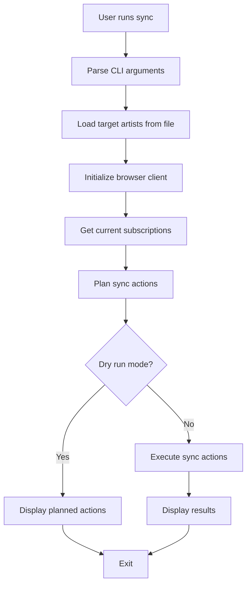
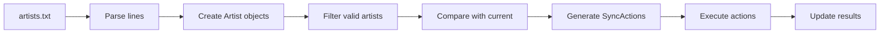

# Architecture Guide

This document describes the architectural design and implementation details of YouTube Music Manager.

## Overview

YouTube Music Manager follows a clean, layered architecture with clear separation of concerns:

```
┌─────────────────┐
│   CLI Layer     │  ← User Interface (ytmusic_manager.cli)
├─────────────────┤
│  Business Logic │  ← Sync Engine (ytmusic_manager.sync)
├─────────────────┤
│  Data Models    │  ← Domain Objects (ytmusic_manager.models)
├─────────────────┤
│ External APIs   │  ← Browser Automation (ytmusic_manager.youtube)
└─────────────────┘
```

## Package Structure

### `ytmusic_manager/` - Main Package

```
ytmusic_manager/
├── __init__.py          # Package initialization
├── cli.py              # Command-line interface
├── models.py           # Data models and types
├── sync.py             # Core synchronization logic
└── youtube.py          # Browser automation
```

### Detailed Module Responsibilities

#### `models.py` - Data Models
**Purpose**: Define the domain objects and data structures

**Key Classes**:
- `Artist` - Represents a music artist with metadata
- `SyncAction` - Represents an action to be performed during sync
- `SyncResult` - Contains results of a sync operation
- `Config` - Configuration settings for the application

**Design Principles**:
- Immutable data structures using `@dataclass(frozen=True)` where appropriate
- Type hints throughout for better IDE support and runtime checking
- Factory methods for complex object creation (e.g., `Artist.from_line()`)
- Property methods for computed values (e.g., `SyncResult.success_count`)

#### `sync.py` - Business Logic
**Purpose**: Orchestrate the synchronization process

**Key Classes**:
- `SyncEngine` - Main orchestrator for sync operations

**Core Methods**:
- `load_target_artists()` - Parse and validate artists file
- `get_current_subscriptions()` - Fetch current YouTube subscriptions
- `plan_sync()` - Determine what actions need to be taken
- `execute_sync()` - Perform the planned actions

**Design Patterns**:
- **Command Pattern** - Each sync action is a command object
- **Strategy Pattern** - Different action types (subscribe, unsubscribe, skip)
- **Template Method** - `sync()` method orchestrates the full process

#### `youtube.py` - External Integration
**Purpose**: Handle browser automation and YouTube Music interaction

**Key Classes**:
- `YouTubeMusicClient` - Selenium-based browser automation

**Core Methods**:
- `search_artist()` - Find artist on YouTube Music
- `subscribe_to_artist()` - Perform subscription action
- `get_subscriptions()` - Extract current subscriptions
- `_scroll_to_load_all()` - Handle infinite scroll pagination

**Design Patterns**:
- **Context Manager** - Automatic browser lifecycle management
- **Adapter Pattern** - Adapts Selenium WebDriver to our domain
- **Circuit Breaker** - Timeout and retry logic for stability

#### `cli.py` - User Interface
**Purpose**: Provide command-line interface and user interaction

**Key Functions**:
- `cmd_sync()` - Handle sync command
- `cmd_list()` - Handle list command  
- `cmd_validate()` - Handle validate command
- `main()` - Application entry point

**Design Patterns**:
- **Command Pattern** - Each CLI command is a separate function
- **Factory Pattern** - Argument parser creation
- **Facade Pattern** - Simplifies complex operations for users

##  Data Flow

### Sync Operation Flow



### Artist Processing Pipeline



##  Design Patterns Used

### 1. Dependency Injection
The `SyncEngine` accepts a `YouTubeMusicClient` and `Config` as dependencies:

```python
class SyncEngine:
    def __init__(self, client: YouTubeMusicClient, config: Config):
        self.client = client
        self.config = config
```

**Benefits**:
- Easy to test with mock objects
- Flexible configuration
- Clear dependencies

### 2. Context Manager Pattern
Browser lifecycle management:

```python
class YouTubeMusicClient:
    def __enter__(self):
        return self
    
    def __exit__(self, exc_type, exc_val, exc_tb):
        if self.driver:
            self.driver.quit()
```

**Benefits**:
- Automatic resource cleanup
- Exception-safe browser handling
- Clear resource boundaries

### 3. Factory Method Pattern
Creating objects from external data:

```python
class Artist:
    @classmethod
    def from_line(cls, line: str) -> "Artist":
        if "|" in line:
            parts = line.split("|")
            name = parts[0].strip()
            tags = [tag.strip() for tag in parts[1:] if tag.strip()]
            return cls(name=name, tags=tags)
        else:
            return cls(name=line.strip())
```

**Benefits**:
- Encapsulates object creation logic
- Validates input during creation
- Provides multiple creation paths

### 4. Command Pattern
Sync actions as command objects:

```python
@dataclass
class SyncAction:
    artist: Artist
    action: SyncActionType  
    reason: str
```

**Benefits**:
- Actions can be queued, logged, and undone
- Easy to add new action types
- Clear separation of planning and execution

### 5. Template Method Pattern
The sync process follows a fixed algorithm:

```python
def sync(self) -> SyncResult:
    # Template method - fixed algorithm, variable steps
    target_artists = self.load_target_artists()
    current_subscriptions = self.get_current_subscriptions()
    actions = self.plan_sync(target_artists, current_subscriptions)
    return self.execute_sync(actions)
```

**Benefits**:
- Consistent process flow
- Extensible individual steps
- Easy to add hooks and validation

##  Error Handling Strategy

### Layered Error Handling

1. **Input Validation** - At the data model level
2. **Business Logic Errors** - In the sync engine
3. **External Service Errors** - In the YouTube client
4. **User Interface Errors** - In the CLI layer

### Error Types

```python
# Domain-specific errors
class ArtistFileNotFoundError(Exception): pass
class BrowserAutomationError(Exception): pass
class SubscriptionError(Exception): pass

# Generic errors are caught and wrapped
try:
    result = self.client.subscribe_to_artist(artist)
except Exception as e:
    logger.error(f"Subscription failed: {e}")
    result.errors.append(f"Failed to subscribe to {artist.name}: {e}")
```

### Recovery Strategies

- **Graceful Degradation** - Continue processing other artists if one fails
- **Retry Logic** - Automatic retries with exponential backoff
- **User Notification** - Clear error messages with suggested actions
- **Logging** - Detailed logs for troubleshooting

##  Testing Architecture

### Test Structure

```
tests/
├── test_models.py      # Unit tests for data models
├── test_sync.py        # Unit tests for sync engine
├── test_youtube.py     # Unit tests for browser client (mocked)
├── test_main.py        # Unit tests for CLI interface
├── test_integration.py # Integration tests
└── conftest.py         # Shared test fixtures
```

### Testing Strategies

#### 1. Unit Tests
- **Models** - Test data validation and business rules
- **Sync Engine** - Test planning and execution logic with mocked dependencies
- **YouTube Client** - Test browser automation logic with mocked WebDriver

#### 2. Integration Tests
- **End-to-End Workflows** - Test complete sync processes
- **File Operations** - Test real file reading and writing
- **Error Scenarios** - Test error handling across layers

#### 3. Test Doubles

**Mocks** - For external dependencies:
```python
@patch('ytmusic_manager.youtube.webdriver.Chrome')
def test_client_initialization(self, mock_chrome):
    client = YouTubeMusicClient()
    mock_chrome.assert_called_once()
```

**Fixtures** - For common test data:
```python
@pytest.fixture
def sample_artists():
    return [
        Artist(name="Artist 1"),
        Artist(name="Artist 2", tags=["rock"])
    ]
```

**Factories** - For dynamic test data creation:
```python
def create_sync_result(success_count=0, error_count=0):
    result = SyncResult()
    result.actions_taken = [mock_action] * success_count
    result.errors = ["error"] * error_count
    return result
```

##  Performance Considerations

### Optimization Strategies

#### 1. Browser Performance
- **Headless Mode** - 30-50% faster than visible browser
- **Connection Reuse** - Single browser session for multiple operations
- **Selective Loading** - Disable images and unnecessary resources

#### 2. Rate Limiting
- **Configurable Delays** - Balance speed vs. detection risk
- **Exponential Backoff** - Handle rate limiting gracefully
- **Batch Operations** - Group similar actions when possible

#### 3. Memory Management
- **Context Managers** - Automatic resource cleanup
- **Generator Patterns** - Stream large datasets
- **Explicit Cleanup** - Close browser sessions properly

### Scalability Considerations

#### Current Limitations
- **Sequential Processing** - One action at a time
- **Single Session** - One browser instance only
- **Memory Usage** - Selenium overhead

#### Future Improvements
- **Parallel Processing** - Multiple browser sessions
- **Connection Pooling** - Reuse browser instances
- **Batch Operations** - Group similar actions
- **Asynchronous Operations** - Non-blocking I/O

##  Extension Points

### Adding New Commands

1. **Create command function** in `cli.py`:
```python
def cmd_export(args):
    """Export subscriptions in various formats."""
    # Implementation here
    return 0
```

2. **Add parser configuration**:
```python
export_parser = subparsers.add_parser('export', help='Export subscriptions')
export_parser.set_defaults(func=cmd_export)
```

### Adding New Action Types

1. **Extend SyncActionType enum**:
```python
class SyncActionType(Enum):
    SUBSCRIBE = "subscribe"
    UNSUBSCRIBE = "unsubscribe"  
    SKIP = "skip"
    UPDATE = "update"  # New action type
```

2. **Add handling in SyncEngine**:
```python
elif planned_action.action == SyncActionType.UPDATE:
    # Handle update logic
    pass
```

### Adding New Data Sources

1. **Extend Artist.from_source() factory**:
```python
@classmethod
def from_json(cls, data: dict) -> "Artist":
    return cls(
        name=data["name"],
        tags=data.get("tags", []),
        # Additional fields
    )
```

2. **Add new loader in SyncEngine**:
```python
def load_from_spotify_playlist(self, playlist_url: str) -> List[Artist]:
    # Implementation here
    pass
```

##  Best Practices

### Code Quality
- **Type Hints** - All public APIs have type annotations
- **Docstrings** - All classes and public methods documented
- **Error Messages** - Clear, actionable error descriptions
- **Logging** - Structured logging with appropriate levels

### Security
- **Input Validation** - All external input validated
- **Safe Defaults** - Dry-run mode enabled by default
- **Rate Limiting** - Prevent abuse and detection
- **No Credential Storage** - Uses existing browser sessions

### Maintainability
- **Single Responsibility** - Each class has one clear purpose
- **Dependency Injection** - Easy to test and modify
- **Configuration** - Externalized and overridable
- **Extensibility** - Clear extension points for new features

---

This architecture provides a solid foundation for the YouTube Music Manager while remaining flexible enough to accommodate future enhancements and requirements.